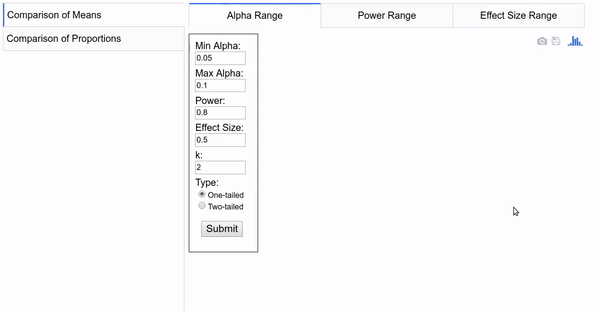

# A/B Test Sample Size Calculator :bar_chart::chart_with_upwards_trend::chart_with_downwards_trend:
Contributors: [Kunal Kotian](https://github.com/kunal-kotian), [Thy Khue (Maise) Ly](https://github.com/maisely), [Yiqiang Zhao](https://github.com/YiQ-Zhao) 
## Overview
**How many sample size do I need for my A/B test?**
Power analysis is an important aspect of experimental design. It allows us to determine the sample size required to detect an effect of a given size with a given degree of confidence. 

The two most common types of hypothesis tested within an A/B test are
* t-tests to compare means in two independent conditions A and B.
* z-tests to compare proportions in two independent conditions A and B.

The [calculator app](http://34.220.48.87/) I developed on [Dash](https://plot.ly/products/dash/) can suggest a common sample size n for each condition based on the following inputs:
* the significant level alpha
* the power of the test 1 - beta
* the effect size delta / assumed parameter values

## Demo
